

<!--
Order:
- Current long term sponsors (Ambient)
- Past sponsors sorted by number of events
-->

[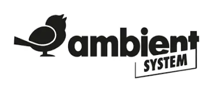](https://ambientsystem.eu/pl/ "Ambient System")
{ .sponsor }

[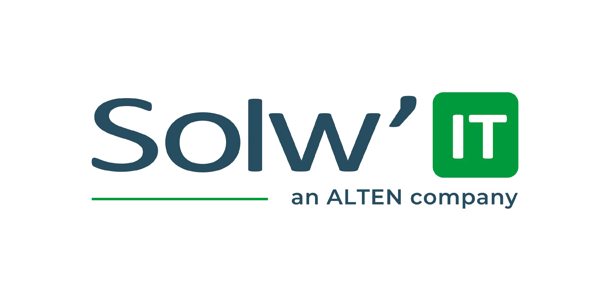](https://solwit.com/ "Solwit")
{ .sponsor }

[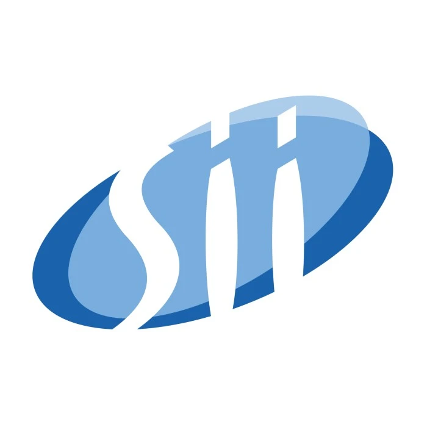](https://sii.pl/ "Sii")
{ .sponsor }

[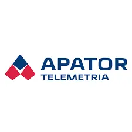](https://www.facebook.com/apatortelemetria/ "Apator Telemetria")
{ .sponsor }

{ .sponsor }

[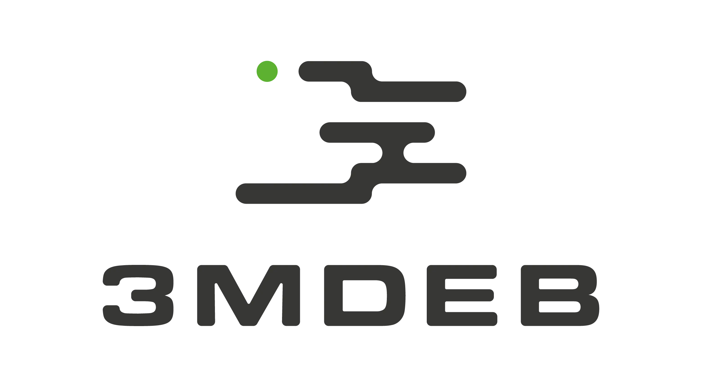](https://3mdeb.com/pl/ "3mdeb")
{ .sponsor }

{ .sponsor }

[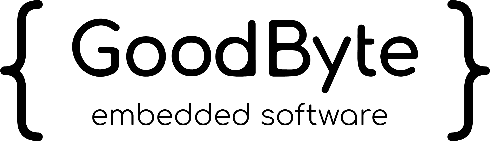](https://www.goodbyte.pl/ "GoodByte")
{ .sponsor }

[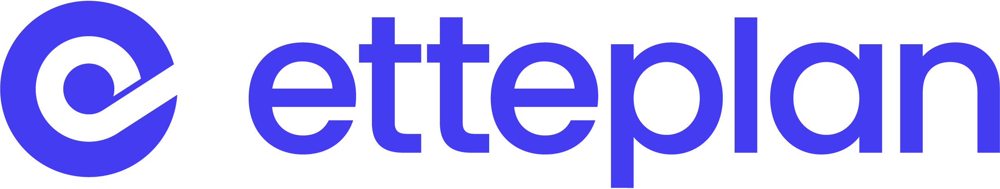](https://www.etteplan.com/pl "Etteplan")
{ .sponsor }

[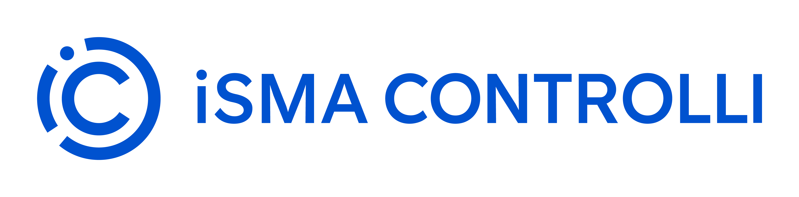](https://www.ismacontrolli.com/en/ "iSMA Controlli")
{ .sponsor }

[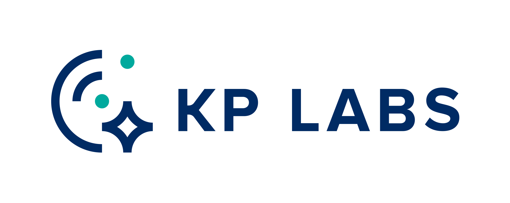](https://kplabs.space/ "KP Labs")
{ .sponsor }

[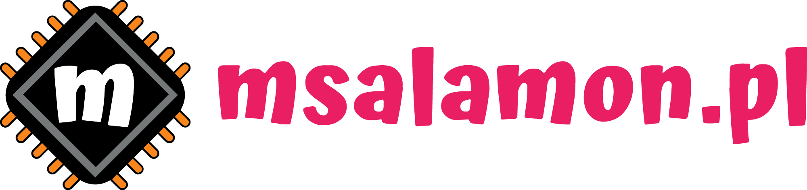](https://sklep.msalamon.pl/ "msalamon.pl")
{ .sponsor }

[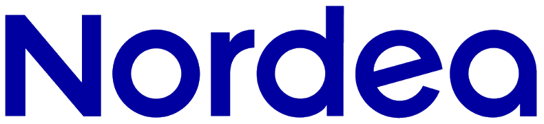](https://nordea.pl/ "Nordea")
{ .sponsor }

[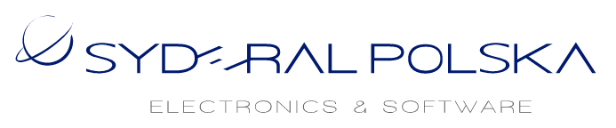](https://www.syderal.pl/ "Syderal Polska")
{ .sponsor }

[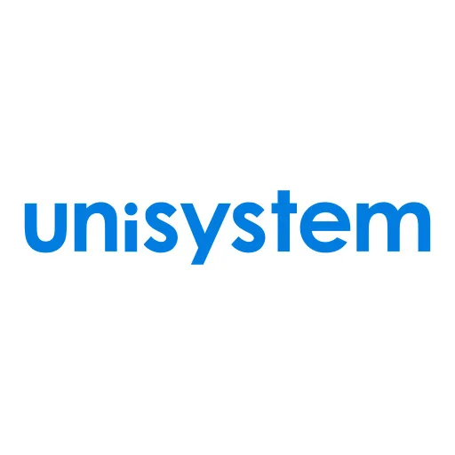](https://unisystem.pl/ "Unisystem")
{ .sponsor }

## Partnerzy organizacyjni

{ .sponsor }

{ .sponsor }

{ .sponsor }

[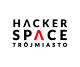](https://hs3.pl// "Hackerspace Trójmiasto")
{ .sponsor }

[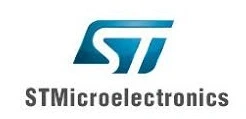](https://www.st.com/content/st_com/en.html "ST Microelectronics")
{ .sponsor }

[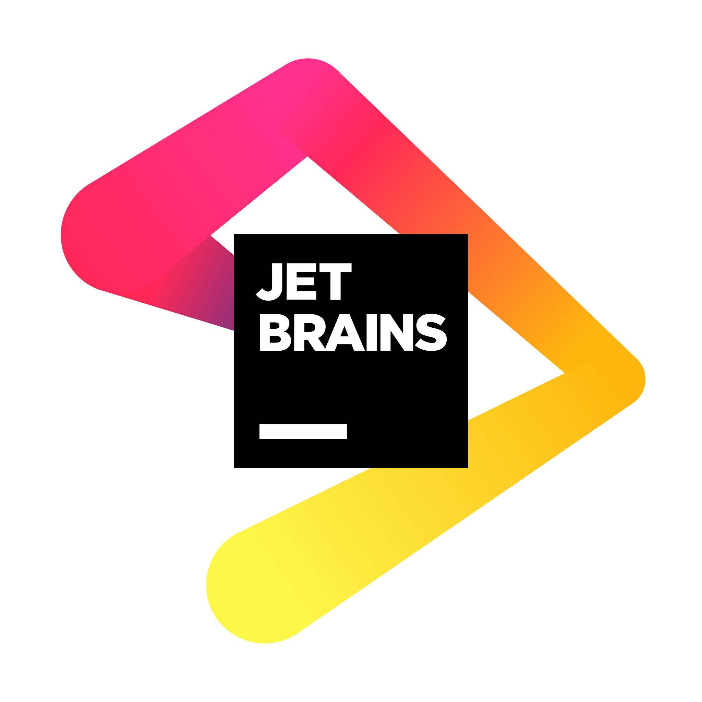](https://www.jetbrains.com/ "JetBrains")
{ .sponsor }

